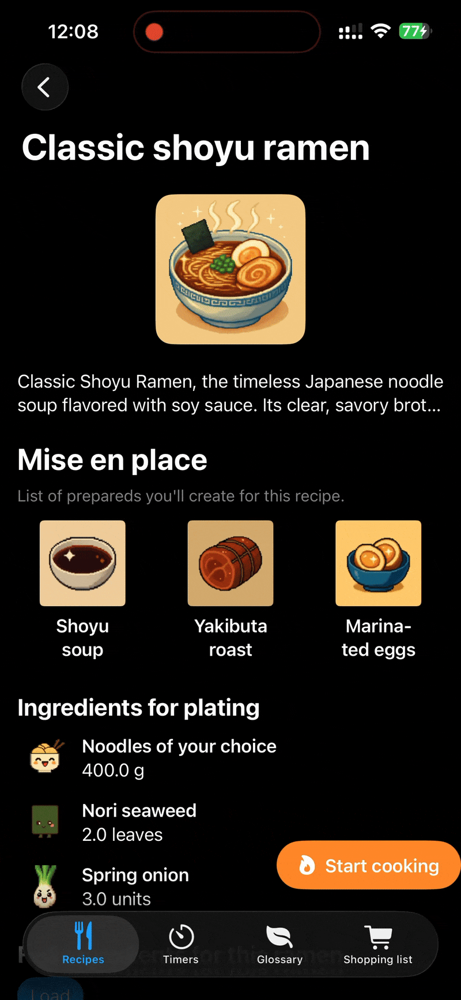

# Kawaii-Ramen-App-presentation

A cute, pixel-art-style iOS app showcasing **kawaii ramen recipes**.
Users can explore recipes, view ingredients, and manage shopping lists with a playful and intuitive interface.

Built with **SwiftUI, SwiftData, and modern iOS frameworks**, following a **Clean Architecture** pattern with Domain, Data, Presentation, and Infrastructure layers.  
This project demonstrates modular architectures, SwiftUI best practices, and integration with backend services.

---

## Video presentation

<em>Full functionality of the application</em>

---

## Features

- Browse a curated list of kawaii ramen recipes
- View full ingredients with quantities and images
- Create, edit, and manage shopping lists
- Mark ingredients as purchased
- Offline-first support with a cache strategy (Actor + SwiftData)
- Notifications and timers for cooking steps
- Subscription management with RevenueCat (demo data)
- Clean, modular architecture suitable for scaling and testing

---

## Architecture

The app follows **Clean Architecture** with the following layers:

- App
  - Composition Root
    - Presentation (SwiftUI + @Observable ViewModels)
    - Domain (Entities, Use Cases, Repository Interfaces)
    - Data (Repositories, Datasources, Mappers, Actors)
    - Infrastructure (Supabase, SwiftData, DispatchSourceTimer, UNUserNotificationCenter, RevenueCat)

- **Domain:** core entities, repository interfaces, use cases
- **Data:** repository implementations, datasources, mappers
- **Infrastructure:** backend integration, local persistence, timers, notifications
- **Presentation:** SwiftUI views and ViewModels managing state and UI

---

## Technologies

- Swift 5 / SwiftUI
- SwiftData (persistent storage)
- @Actor for in-memory caching
- DispatchSourceTimer for precise timers
- UNUserNotificationCenter for notifications
- Supabase for backend services
- RevenueCat for subscription management
- Async/await concurrency
- Git & Xcode Instruments for debugging and performance
